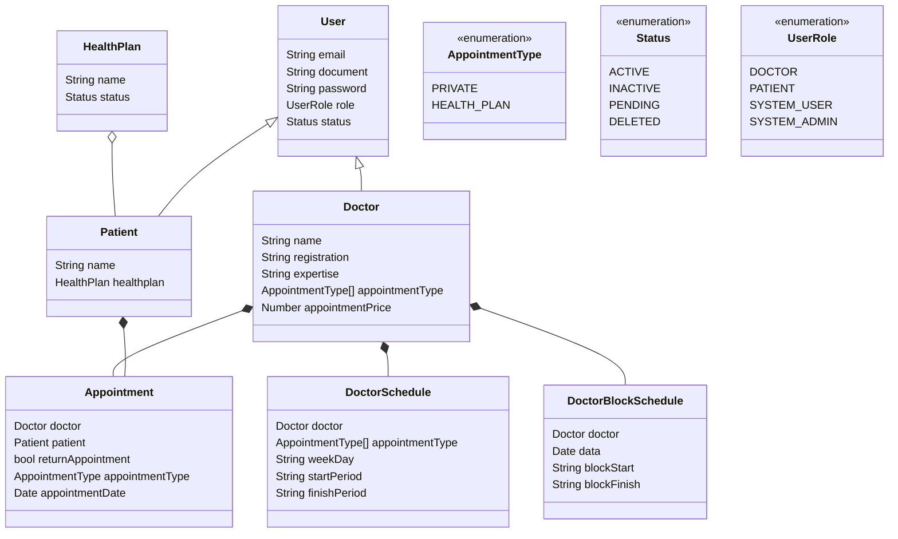

# ai-scheduler-api

```bash
bun install
```

To run:

```bash
bun run index.ts
```

This project was created using `bun init` in bun v1.2.14. [Bun](https://bun.sh) is a fast all-in-one JavaScript runtime.

## API Documentation

Comprehensive API documentation is available via Swagger UI. Once the application is running, you can access it at:

`http://localhost:<PORT>/api-docs` (replace `<PORT>` with the actual port number, typically 3000).

The API uses Zod for request validation, ensuring data integrity for operations like creating and updating doctors.

## Class Diagram



### Class diagram next steps:
1. Add medical specialty entity, the medical procedures related to that and also the preparation before the appointment.

## Doctor API Endpoints

Base path: `/api/doctors`

*(Note: Request data for POST and PUT operations is validated using Zod. See the API Documentation section above for more details and access to Swagger UI for interactive testing.)*

### `POST /`
Create a new doctor.
- **Request Body:**
  ```json
  {
    "name": "Dr. John Doe",
    "registration": "CRM123456",
    "expertise": "Cardiology",
    "appointmentType": ["PRIVATE", "HEALTH_PLAN"],
    "appointmentPrice": 200.50
  }
  ```
- **Responses:**
  - `201 Created`: Returns the created doctor object.
  - `400 Bad Request`: If required fields are missing or validation fails.
  - `409 Conflict`: If a doctor with the same registration already exists.
  - `500 Internal Server Error`: If there's a server-side error.

### `GET /`
Get all doctors.
- **Responses:**
  - `200 OK`: Returns an array of doctor objects.
  - `500 Internal Server Error`: If there's a server-side error.

### `GET /:id`
Get a doctor by ID.
- **Parameters:**
  - `id` (string): The ID of the doctor.
- **Responses:**
  - `200 OK`: Returns the doctor object.
  - `400 Bad Request`: If the ID format is invalid.
  - `404 Not Found`: If the doctor with the specified ID is not found.
  - `500 Internal Server Error`: If there's a server-side error.

### `PUT /:id`
Update a doctor by ID.
- **Parameters:**
  - `id` (string): The ID of the doctor to update.
- **Request Body:** Partial doctor object with fields to update.
  ```json
  {
    "name": "Dr. Jane Doe",
    "appointmentPrice": 250.00
  }
  ```
- **Responses:**
  - `200 OK`: Returns the updated doctor object.
  - `400 Bad Request`: If the ID format is invalid, or validation fails for the request body, or if the body is empty.
  - `404 Not Found`: If the doctor with the specified ID is not found.
  - `409 Conflict`: If updating the registration to one that already exists.
  - `500 Internal Server Error`: If there's a server-side error.

### `DELETE /:id`
Delete a doctor by ID.
- **Parameters:**
  - `id` (string): The ID of the doctor to delete.
- **Responses:**
  - `200 OK`: Returns a success message and the deleted doctor object.
  - `400 Bad Request`: If the ID format is invalid.
  - `404 Not Found`: If the doctor with the specified ID is not found.
  - `500 Internal Server Error`: If there's a server-side error.