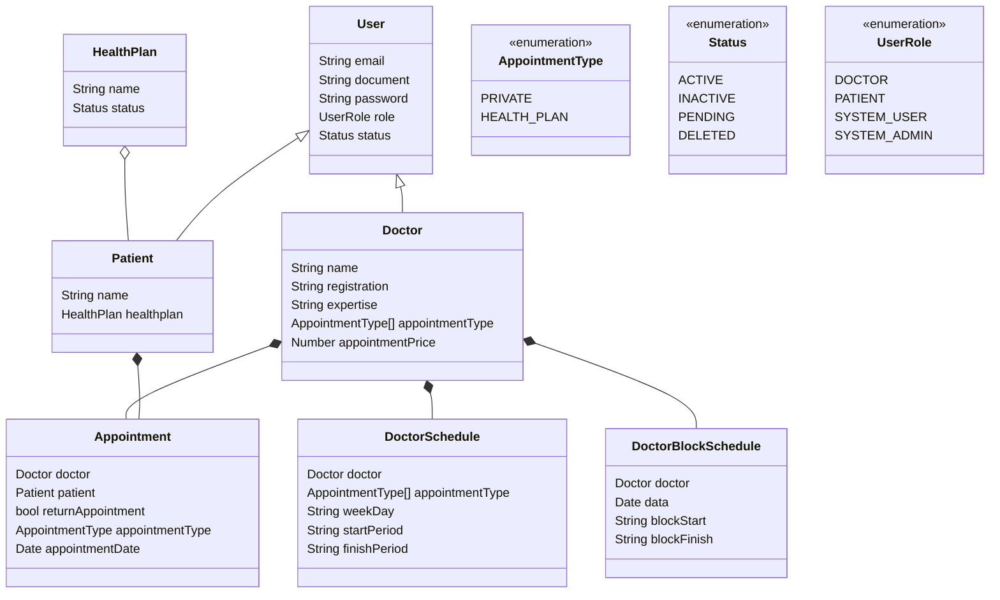

# ai-scheduler-api

```bash
bun install
```

To run:

```bash
bun run index.ts
```

This project was created using `bun init` in bun v1.2.14. [Bun](https://bun.sh) is a fast all-in-one JavaScript runtime.


## Class Diagram



### Class diagram next steps:
1. Add medical specialty entity, the medical procedures related to that and also the preparation before the appointment.